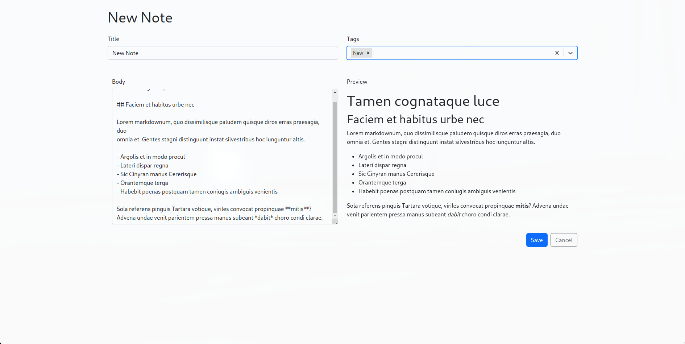

  
  <h1>TakeNote</h1>
  
TakeNote is a simple note taking app that allows you to take notes and segregate them using tags. It is built using Go (Backend) and TypeScript React (Frontend)

## Features

- Create notes and tag them
- Edit notes and their tags
- Delete notes
- Delete tags
- Filter notes by tags
- Save notes 
- Search notes

# Preview

  
  
  
    

